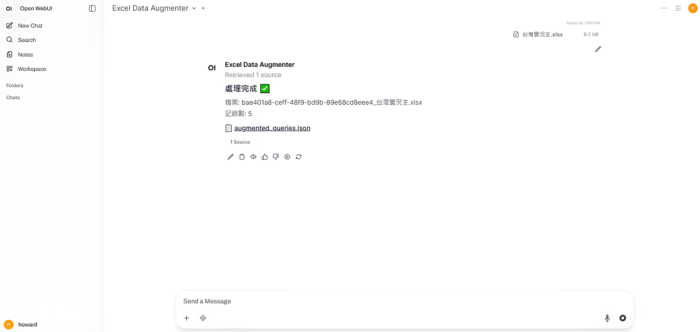

# Auto QGen

## 介紹

在建構檢索系統時，可能面臨缺乏「真實使用者問題」的狀況，因此無法有效評估 RAG／檢索系統的品質。本工具透過以下核心架構與特色，從現有內容自動生成多樣化、具代表性的測試問題，用於比較與優化 RAG / 檢索系統。

**核心架構：**

* **Parser LLM**：使用 LLM 智能解析檔案，提取結構化資訊與關鍵內容。
* **Query Augmenter**：根據解析結果，利用 LLM 生成多樣化查詢問題。
* **Pipeline**：`檔案 → Parser 解析 → Augmenter 生成 → 測試問題集`

**特色：**

* 支援多模型生成
* 支援雲端與地端模型
* 可與 Open-WebUI / API 工作流直接整合

<p align="center">
  
</p>


## 三種使用方式

### 方式 1: 命令列腳本
```bash
pip install -r requirements.txt
cp config/config.example.yml config/my_config.yml
python scripts/main.py --config config/my_config.yml
```

### 方式 2: FastAPI 服務
```bash
python app.py  # 啟動 http://localhost:8000
curl -X POST "http://localhost:8000/api/v1/data_augment" \
  -F "file=@your_file.xlsx" \
  -F "parser_api_key=YOUR_KEY" \
  -F "augmenter_api_key=YOUR_KEY"
```

### 方式 3: Open WebUI 整合
匯入 [open_webui_pipeline.py](open_webui_pipeline.py) 到 Open WebUI,透過聊天介面使用
詳見 [plans/OPEN_WEBUI_INTEGRATION.md](plans/OPEN_WEBUI_INTEGRATION.md)

## 專案結構

```
augmenter/
├── app.py                             # FastAPI 服務入口
├── open_webui_pipeline.py             # Open WebUI 整合
├── scripts/main.py                    # 命令列執行腳本
│
├── service/                           # 業務邏輯層
│   └── augment_service.py            # 整合 Parser + Augmenter
│
├── utils/                             # 核心功能模組
│   ├── parser/                       # Excel → 結構化資料
│   │   └── excel_parser_llm.py
│   ├── augmenter/                    # 資料 → 查詢問題
│   │   └── llm_augmenter.py
│   ├── prompt_manager/               # Prompt 管理與自訂
│   │   ├── manager.py
│   │   ├── prompts_config.yml
│   │   └── ui/app.py                # Streamlit UI
│   └── schemas.py                    # Pydantic 資料模型
│
├── config/                            # LLM 配置檔
│   └── config.example.yml
│
├── data/                              # 輸入資料
│   └── raw_data/
│
└── results/                           # 輸出結果
    └── [timestamp]/
        ├── parsed_data.json
        └── augmented_queries.json
```

## 核心模組

### Parser - Excel 智慧解析
```python
from utils.parser.excel_parser_llm import ExcelParserLLM

parser = ExcelParserLLM(
    vllm_url="https://openrouter.ai/api",
    model="openai/gpt-oss-20b:free",
    api_key="YOUR_KEY"
)
result = parser.parse_excel_with_llm("file.xlsx")
```

### Augmenter - 問題生成
```python
from utils.augmenter.llm_augmenter import LLMAugmenter
from utils.schemas import AugmenterInput, GroundTruth

augmenter = LLMAugmenter(
    vllm_url="https://openrouter.ai/api",
    model="openai/gpt-oss-20b:free",
    prompt_name="default"
)
input_data = AugmenterInput(
    keyword={"標題": "...", "內容": "..."},
    ground_truth=GroundTruth(file_name="file.xlsx", item_id=[1,2,3])
)
queries = augmenter.augment(input_data)
```

### Prompt Manager - 新增/刪除/編輯 Prompt
```bash
cd utils/prompt_manager/ui && streamlit run app.py
```
詳見: [utils/prompt_manager/README.md](utils/prompt_manager/README.md)

### Service - 完整流程封裝
```python
from service.augment_service import AugmentService

service = AugmentService(config={"parser": {...}, "augmenter": {...}})
result = service.run(input_file="file.xlsx", output_dir="results/")
```

## API 文件

```bash
python app.py  # 啟動服務
# 訪問 http://localhost:8000/docs 查看完整 API 文件
```

### 主要端點

| 端點 | 方法 | 說明 |
|------|------|------|
| `/api/v1/data_augment` | POST | 上傳 Excel,執行解析與問題生成 |
| `/api/v1/download/{type}/{timestamp}` | GET | 下載結果檔案 |
| `/api/v1/health` | GET | 健康檢查 |

### 範例回應
```json
{
  "success": true,
  "parsed_data_path": "results/api_20251116/parsed_data.json",
  "augmented_queries_path": "results/api_20251116/augmented_queries.json",
  "total_count": 20
}
```

## 輸出格式

**Parser 輸出** (`parsed_data.json`)
```json
{
  "title": "表格標題",
  "cells": [{"cell_address": "A1", "content": "內容", ...}]
}
```

**Augmenter 輸出** (`augmented_queries.json`)
```json
[{
  "augmented_queries": ["問題1", "問題2", "問題3"],
  "ground_truth": {"file_name": "file.xlsx", "item_id": [1,2,3]}
}]
```

## 進階配置

### 混合使用本地/雲端 LLM
```yaml
parser:
  llm:
    url: "http://localhost:8000"    # 本地 vLLM (省錢)
    model: "gemma-12b-8bit"
    use_openrouter: false

augmenter:
  llm:
    url: "https://openrouter.ai/api"  # 雲端 (快速)
    model: "google/gemini-2.0-flash-exp:free"
    use_openrouter: true
```

### 自訂 Prompts
透過 UI 管理:
```bash
cd utils/prompt_manager/ui && streamlit run app.py
```

透過程式碼:
```python
from utils.prompt_manager import PromptManager
pm = PromptManager()
pm.add_prompt(
    prompt_name="medical_expert",
    system_role="你是醫療專家",
    task="生成3-5個專業查詢"
)
```

## 功能狀態

### 已完成
- Excel 檔案解析與問題生成
- FastAPI 服務 + Open WebUI 整合
- Prompt 管理與自訂 UI
- 多種 LLM 支援 (本地/OpenRouter)

### 規劃中
- PDF/Word 檔案支援
- 批次處理 API
- 問題品質評估指標
- Docker 容器化

## 常見問題

**Q: Parser 和 Augmenter 可以用不同 LLM 嗎?**
A: 可以,在 config 中分別設定 `parser.llm` 和 `augmenter.llm`

**Q: 如何跳過 Parser 直接生成問題?**
A: 使用 `--skip-parser --parsed-output results/parsed_data.json`

**Q: 支援哪些 LLM?**
A: OpenRouter、本地 vLLM、任何 OpenAI 相容 API

**Q: 如何部署到生產環境?**
```bash
uvicorn app:app --host 0.0.0.0 --port 8000 --workers 4
```

## 相關文件

- [Parser 使用說明](utils/parser/README.md)
- [Prompt Manager 文件](utils/prompt_manager/README.md)
- [Open WebUI 整合指南](plans/OPEN_WEBUI_INTEGRATION.md)
- [腳本使用說明](scripts/README.md)

---

**技術棧**: FastAPI, OpenAI SDK, Pydantic, openpyxl, Streamlit

**LLM 支援**: OpenRouter, vLLM, OpenAI-compatible APIs
