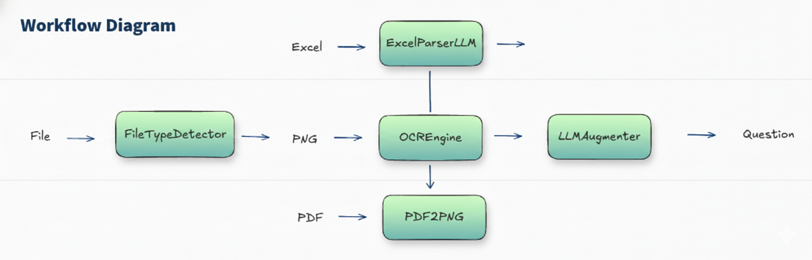

# Auto-Gen MultiModel

自動根據輸入文件類型生成問題的工具，支援 Excel、圖片、PDF 三種格式。



## 特色

1. **多格式支援** - 支援 PDF、PNG、Excel 等多種文件格式
2. **多模型支援** - 相容 Mistral AI、GPT、Gemma 等不同 LLM 模型
3. **UI 可視化** - 提供 Web UI 介面，方便操作與管理

## 快速開始

```bash
# 使用配置文件執行（推薦）
python core/main.py --config configs/pipeline.yml

# 覆蓋配置中的輸入文件
python core/main.py --config configs/pipeline.yml --input data/example.xlsx
```

### 命令列參數

| 參數 | 說明 |
|------|------|
| `--config`, `-c` | 配置檔路徑（預設：`configs/pipeline.yml`） |
| `--input`, `-i` | 輸入文件路徑（可覆蓋配置文件設定） |
| `--type`, `-t` | 強制指定類型：`excel`、`image`、`pdf`、`auto` |

## 配置文件說明

配置文件使用 YAML 格式，範例請參考 [configs/pipeline.yml](configs/pipeline.yml)

### 基本結構

```yaml
pipeline_type: auto  # 自動檢測文件類型
input: data/example.xlsx

metadata:  # 選用
  test_name: "測試名稱"

excel:
  # Excel 設定...

image:
  # 圖片設定...

pdf:
  # PDF 設定...
```

### Excel 設定

```yaml
excel:
  output_dir: results/excel/

  parser:
    prompt_name: excel_parser
    llm:
      url: http://localhost:8000/v1/chat/completions
      model: your-model-name
      api_key: null

  augmenter:
    prompt_name: default
    mode: vllm
    vllm:
      url: http://localhost:8000/v1/chat/completions
      model_name: your-model-name
      max_tokens: 4096
      temperature: 0.7
```

### Image 設定

```yaml
image:
  ocr:
    output_dir: results/ocr/
    engine: dotsocr  # 或 paddle
    mode: vllm
    vllm:
      url: http://localhost:8000/v1/chat/completions
      model_name: your-ocr-model
      max_tokens: 4096

  gen_ques:
    output_dir: results/ocr/
    mode: vllm
    prompt_name: default
    vllm:
      url: http://localhost:8000/v1/chat/completions
      model_name: your-model-name
      max_tokens: 4096
```

### PDF 設定

```yaml
pdf:
  conversion:
    dpi: 200
    format: PNG
    max_size: 1024

  ocr:
    # 同 image.ocr 設定

  gen_ques:
    # 同 image.gen_ques 設定
```

### vLLM 重要參數

所有 Pipeline 都需要配置 vLLM 連接：

- `url`: vLLM 服務地址
- `model_name`: 模型名稱
- `max_tokens`: 最大生成長度
- `temperature`: 溫度參數（0-1）
- `prompt_name`: Prompt 模板名稱

## 支援格式

- **Excel**: `.xlsx`, `.xls`, `.xlsm`, `.xlsb`
- **圖片**: `.png`, `.jpg`, `.jpeg`, `.bmp`, `.gif`, `.tiff`, `.webp`
- **PDF**: `.pdf`